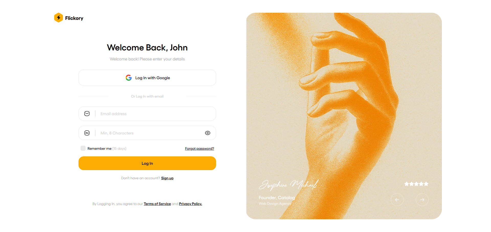
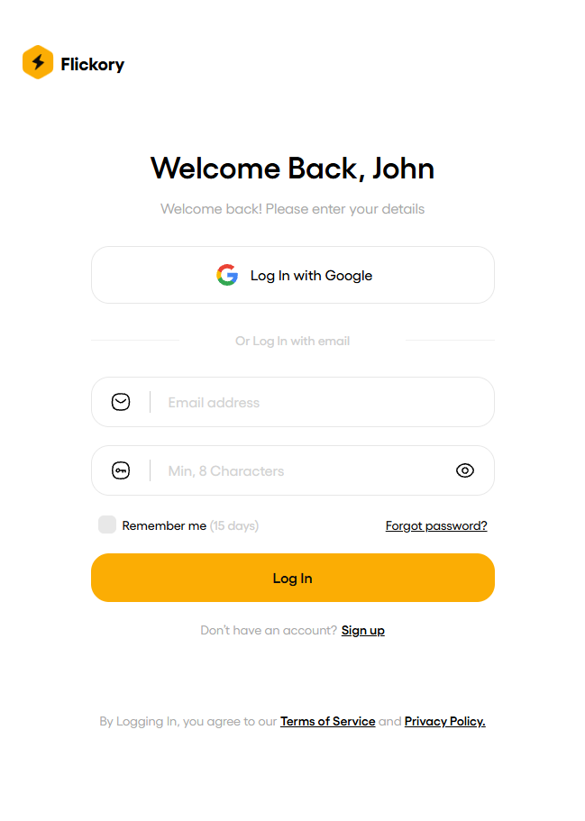

## Responsive Sign-Up Form 2

A clean and fully responsive **sign-up form** built with **HTML, CSS, and Tailwind CSS**.  
The main goal of this project was to **practice building responsive layouts using Tailwind CSS** and improve front-end development skills.

🔗 [Live Demo](https://yasin-tahmasbi.github.io/Responsive-Sign-Up-Form2/)

## 🛠️ Features

- Fully responsive layout built with **Tailwind CSS**
- Designed and coded using **HTML5 & CSS3**
- Clean and minimal UI design
- Focused on practicing responsive design and utility-first workflow
- Easy to customize and extend for other form-based projects

## 👤 Credits

- **Developed by:** [Yasin Tahmasbi](https://yasintahmasbi.ir/)
- **Mentorship:** [Parsa Ghorbanian](https://www.instagram.com/parsa_ghorbanian_web/#)
- **Date:** Nov , 2025

## **🔗 Want to reach out?**

Everything you need is on my website 👇

-  [**www.yasintahmasbi.ir**](https://www.yasintahmasbi.ir)

## 📷 Preview | Screenshots

